# 🧠 Introdução ao Deep Learning

### Fundamentos, Arquiteturas de Redes Neurais e Aplicações Práticas

*Do Perceptron biológico às redes profundas modernas — teoria, matemática e prática com MNIST.*

---

## 📖 Sobre

Este repositório reúne o material de estudo da aula **"Introdução ao Deep Learning"**, cobrindo desde a inspiração biológica do neurônio artificial até a construção, treinamento e avaliação de uma rede neural completa para classificação de dígitos manuscritos (MNIST).

O conteúdo caminha em três frentes:

- 🧩 **Base Teórica** — do Perceptron à Multilayer Perceptron (MLP), funções de ativação e funções de perda.
- ⚙️ **Base Prática** — otimizadores (SGD, Adam), backpropagation e os frameworks de mercado (TensorFlow/Keras vs. PyTorch).
- 🔢 **Estudo de Caso** — classificação do dataset MNIST, do pré-processamento à arquitetura final da rede.

---

## 🗺️ Trilha de Aprendizagem

```mermaid
graph LR
    A[🧠 O que é<br/>Deep Learning?] --> B[⚡ Perceptron]
    B --> C[🕸️ Multilayer<br/>Perceptron]
    C --> D[🔥 Funções de<br/>Ativação]
    D --> E[📉 Funções de<br/>Perda]
    E --> F[🎯 Otimizadores]
    F --> G[🛠️ Keras vs<br/>PyTorch]
    G --> H[🔢 Estudo de Caso<br/>MNIST]
    H --> I[💻 Atividade<br/>Prática]

    style A fill:#10a37f,color:#fff
    style B fill:#10a37f,color:#fff
    style C fill:#10a37f,color:#fff
    style D fill:#2196f3,color:#fff
    style E fill:#2196f3,color:#fff
    style F fill:#2196f3,color:#fff
    style G fill:#673ab7,color:#fff
    style H fill:#673ab7,color:#fff
    style I fill:#673ab7,color:#fff
```

---

## 📑 Índice

- [🎯 Objetivos da Aula](#-objetivos-da-aula)
- [✅ Pré-requisitos](#-pré-requisitos)
- [1️⃣ O que é Deep Learning?](#1️⃣-o-que-é-deep-learning)
- [2️⃣ O Perceptron](#2️⃣-o-perceptron)
- [3️⃣ Multilayer Perceptron (MLP)](#3️⃣-multilayer-perceptron-mlp)
- [4️⃣ Funções de Ativação](#4️⃣-funções-de-ativação)
- [5️⃣ Funções de Perda](#5️⃣-funções-de-perda-loss-functions)
- [6️⃣ Otimizadores](#6️⃣-otimizadores)
- [7️⃣ Frameworks: Keras vs PyTorch](#7️⃣-frameworks-keras-vs-pytorch)
- [8️⃣ Estudo de Caso: MNIST](#8️⃣-estudo-de-caso-classificação-mnist)
- [9️⃣ Atividade Prática](#9️⃣-atividade-prática)
- [🛠️ Tecnologias](#️-tecnologias)
- [📖 Referências](#-referências-bibliográficas)
- [🖼️ Créditos de Imagens](#️-créditos-de-imagens)

---

## 🎯 Objetivos da Aula

<table>
<tr>
<td width="50%" valign="top">

### 📚 1. Base Teórica

- Compreender os fundamentos do Deep Learning, do **Perceptron** à arquitetura de uma **Multilayer Perceptron (MLP)**.
- Analisar o papel crucial das **Funções de Ativação** e das **Funções de Perda** no aprendizado.

</td>
<td width="50%" valign="top">

### ⚙️ 2. Base Prática

- Diferenciar os otimizadores (**SGD**, **Adam**) e entender o mecanismo de **Backpropagation**.
- Conhecer ferramentas de mercado (**TensorFlow/Keras** vs. **PyTorch**) e aplicar os conceitos na classificação do dataset **MNIST**.

</td>
</tr>
</table>

---

## ✅ Pré-requisitos

| | Requisito | Descrição |
|---|---|---|
| `</>` | **Lógica de Programação e Python Básico** | Necessário para entender a estrutura dos códigos, loops e utilização de bibliotecas. |
| `√x` | **Noções de Álgebra Linear** | Compreensão sobre vetores, matrizes e produto escalar (*dot product*), essenciais para os cálculos de pesos. |
| 🧠 | **Machine Learning Introdutório** | Familiaridade com conjuntos de treino/teste, underfitting/overfitting e classificação vs. regressão. |
| 💻 | **Ambiente Configurado** | VS Code ou Google Colab, com pacotes básicos como `numpy` e `pandas` instalados. |

---

## 1️⃣ O que é Deep Learning?

**Deep Learning (DL)** é um subcampo do Machine Learning que utiliza redes neurais artificiais com **múltiplas camadas** (o termo "profundo").

> 💡 **Diferencial:** enquanto modelos clássicos dependem da extração manual de características (*feature engineering*), o DL aprende representações hierárquicas dos dados **automaticamente**, extraindo padrões abstratos diretamente dos dados brutos.

### 🚀 Por que Deep Learning agora?

| 🗄️ Grandes Volumes | 🖥️ Hardware Poderoso | 💡 Avanços Algorítmicos |
|---|---|---|
| O surgimento de datasets massivos (ex: ImageNet) permitiu treinar modelos complexos sem overfitting drástico. | GPUs modernas possibilitaram a paralelização intensa de cálculos, reduzindo treinos de meses para horas. | Técnicas como ReLU, dropout e otimizadores eficientes tornaram as redes profundas viáveis. |

### 🌍 Aplicações no Mundo Real

| Área de Estudo | Aplicações Típicas |
|---|---|
| 👁️ Visão Computacional | Reconhecimento facial, diagnóstico por imagem, carros autônomos, detecção de objetos |
| 💬 Processamento de Linguagem Natural | Tradução automática, geração de texto, análise de sentimentos, resumos |
| 🎬 Sistemas de Recomendação | Personalização em plataformas como Netflix, Spotify, Amazon e redes sociais |
| 🎮 Jogos e Robótica | Agentes inteligentes como AlphaGo e OpenAI Five |
| 🧬 Biologia e Saúde | Predição de estruturas de proteínas (AlphaFold), descoberta de fármacos |

---

## 2️⃣ O Perceptron

### 🧬 Inspiração Biológica

O Perceptron é a unidade matemática fundamental das Redes Neurais Artificiais, inspirado no funcionamento dos neurônios biológicos:

- **Dendritos:** recebem os sinais de entrada.
- **Corpo Celular:** processa os estímulos recebidos.
- **Axônio:** se o estímulo ultrapassar um certo limiar de ativação, o neurônio "dispara" um sinal adiante.

### 🧮 Modelo Matemático

O Perceptron calcula uma soma ponderada de suas entradas e aplica uma função de limiar (*step function*) para determinar a saída:

$$f(x; w, b) = \begin{cases} +1 & \text{se } w^T x + b \geq 0 \\ -1 & \text{caso contrário} \end{cases}$$

> Geometricamente, ele representa um **hiperplano** que divide o espaço de features em duas regiões distintas, realizando uma classificação linear.

### 🏋️ Algoritmo de Treinamento

1. **Passo 1:** inicialize pesos (`w`) e bias (`b`) com zeros ou valores aleatórios muito pequenos.
2. **Passo 2:** para cada amostra de treinamento, calcule a saída predita pela fórmula matemática.
3. **Passo 3:** compare a predição com o valor real. Se estiver errada, ajuste os pesos na direção do erro.
4. **Passo 4:** repita o processo até que as amostras sejam classificadas corretamente (se linearmente separáveis) ou até o limite de épocas.

### ⚠️ A Limitação: Problema XOR

O Perceptron simples de uma única camada possui uma fraqueza matemática comprovada: **é incapaz de aprender funções que não são linearmente separáveis** — o caso clássico é a porta lógica **XOR**. Essa limitação impulsionou a criação das arquiteturas de múltiplas camadas (MLP).

---

## 3️⃣ Multilayer Perceptron (MLP)

### 🕸️ Arquitetura da MLP

A MLP resolve o problema da não-linearidade e é composta por:

- **Input Layer:** recebe os dados brutos de entrada.
- **Hidden Layers:** camadas ocultas responsáveis pelas transformações não-lineares dos dados.
- **Output Layer:** produz a predição final do modelo.

> As camadas são *"Fully Connected"* (Densas) — todos os neurônios se conectam à próxima camada.

### ➡️ Forward Propagation

O *Forward Propagation* é o processo pelo qual os dados fluem pela rede, camada por camada, até gerar uma previsão na saída:

$$z^{(l)} = W^{(l)} \cdot a^{(l-1)} + b^{(l)}$$

$$a^{(l)} = g(z^{(l)})$$

Onde **W** são os pesos, **a** são as ativações, **b** é o viés e **g** é a função de ativação não-linear aplicada em cada etapa.

### 🧭 Mecanismo do Gradiente

| O que é? | O que ele faz? | A Importância |
|---|---|---|
| Vetor que aponta a direção onde a função de erro aumenta mais rápido — a derivada da perda em relação aos pesos. | No Gradiente Descendente, atualizamos os pesos na direção **oposta** ao gradiente para minimizar o erro geral. | Funciona como uma "bússola", orientando cada neurônio sobre como ajustar suas conexões. |

### ⬅️ Backpropagation (Regra da Cadeia)

$$\frac{\partial L}{\partial W^{(l)}} = \frac{\partial L}{\partial z^{(l)}} \cdot \frac{\partial z^{(l)}}{\partial W^{(l)}} = \delta^{(l)} \cdot (a^{(l-1)})^T$$

1. Calcula a perda na saída.
2. Propaga o erro de trás para frente.
3. Calcula o gradiente para os pesos de cada camada.
4. Atualiza os pesos.

### 🔄 Forward vs Backpropagation

| | ➡️ Forward Propagation | ⬅️ Backpropagation |
|---|---|---|
| **Objetivo** | Calcular a saída (previsão) da rede. Usado no treino **e** na inferência. | Ajustar os pesos minimizando o erro. Usado **exclusivamente** no treino. |
| **Fluxo** | Dados fluem da entrada à saída via multiplicações de matrizes e ativações. | O erro "viaja" de volta ao início, distribuindo a "culpa" via derivadas parciais. |

---

## 4️⃣ Funções de Ativação

> ⚠️ **Por que não-linearidade?** Se usarmos apenas funções lineares (ou nenhuma ativação), não importa o número de camadas ocultas — a rede se comportará como uma única camada linear, pois multiplicar várias matrizes lineares em sequência equivale a multiplicar por uma única matriz combinada. Funções não-lineares permitem que o modelo dobre e torça o espaço vetorial, aprendendo relações complexas.

📈 <b>Sigmoid</b> — mapeia para (0, 1)

$$\sigma(x) = \frac{1}{1+e^{-x}} = \frac{e^x}{e^x+1}$$

- **Uso principal:** camada de saída para classificação binária.
- **Problema histórico:** *Vanishing Gradient* — para valores muito altos/baixos, a curva satura, a derivada tende a zero e a rede para de aprender nas camadas iniciais.

📉 <b>Tanh</b> — mapeia para (-1, 1)

$$\tanh(x) = \frac{e^x - e^{-x}}{e^x + e^{-x}}$$

- **Vantagem:** centrada em zero, gerando um fluxo de gradiente mais forte que a Sigmoid.
- **Problema:** ainda sofre saturação nas extremidades e *Vanishing Gradient* em redes profundas.

⚡ <b>ReLU</b> — a preferida da atualidade

$$\text{ReLU}(x) = \max(0, x)$$

- **Vantagens:** extremamente eficiente computacionalmente; derivada constante para valores positivos, não satura.
- **Desvantagem:** *Dying ReLU* — se muitos neurônios ficarem no lado negativo, seus gradientes zeram permanentemente, "matando" partes da rede.

🎯 <b>Softmax</b> — padrão para multiclasse

$$\text{Softmax}(x_i) = \frac{e^{x_i}}{\sum_{j=1}^{K} e^{x_j}}$$

Converte os *logits* brutos da rede em uma distribuição de probabilidade válida — a soma de todas as saídas é sempre **1**.

---

## 5️⃣ Funções de Perda (Loss Functions)

A **Função de Perda** quantifica a distância matemática entre as predições do modelo e os valores reais. É o **termômetro do aprendizado**: valor alto → previsões ruins; valor baixo → previsões próximas da realidade. O objetivo central de todo o Deep Learning é a **minimização** dessa função.

### 📏 Erro Quadrático Médio (MSE) — Regressão

$$MSE = \frac{1}{n}\sum_{i=1}^{n}(y_i - \hat{y}_i)^2$$

Ao elevar as diferenças ao quadrado, o modelo penaliza severamente grandes erros (*outliers*) e garante uma derivada suave para o otimizador.

### 🎯 Entropia Cruzada (Cross-Entropy) — Classificação

$$BCE = -\frac{1}{n}\sum_{i=1}^{n}\left[y_i \log(\hat{y}_i) + (1-y_i)\log(1-\hat{y}_i)\right]$$

Se o modelo confia muito em uma predição errada, a perda resultante **explode logaritmicamente**.

### 📋 Resumo: Escolha de Configuração

| Tipo de Problema | Função de Perda | Ativação de Saída |
|---|---|---|
| Regressão Contínua | MSE / MAE | Linear (nenhuma) |
| Classificação Binária | Binary Cross-Entropy | Sigmoid |
| Classificação Multiclasse (One-Hot) | Categorical Cross-Entropy | Softmax |
| Multiclasse (Rótulos Inteiros) | Sparse Categorical Cross-Entropy | Softmax |

---

## 6️⃣ Otimizadores

### 📉 Gradiente Descendente Clássico

$$w \leftarrow w - \eta \nabla_w L$$

- **w:** pesos da rede.
- **η (Learning Rate):** tamanho do passo — grande demais o modelo diverge, pequeno demais o treino demora infinito.
- **Sinal negativo:** movemos na direção oposta ao crescimento do gradiente.

### 🎲 Stochastic Gradient Descent (SGD)

Em vez de usar todo o dataset para calcular a atualização perfeita do gradiente, usamos apenas um **minibatch** aleatório.

| ✅ Vantagem | ⚠️ Desvantagem |
|---|---|
| Treinos velozes, capazes de lidar com dados maiores que a RAM da GPU. Ajuda a escapar de mínimos locais. | Atualizações ruidosas — a descida rumo ao erro mínimo é um caminho em zigue-zague, não uma linha reta. |

### 🎳 Momentum

Inspirado na física, suaviza as oscilações do SGD acumulando parte do gradiente das iterações anteriores — como uma bola ganhando inércia ladeira abaixo:

$$v_t = \beta v_{t-1} + (1-\beta)\nabla_w L$$

$$w \leftarrow w - \eta v_t$$

### 🏆 Adam (Adaptive Moment Estimation)

Otimizador padrão moderno — combina Momentum com adaptação da taxa de aprendizado **por peso individual**:

$$w \leftarrow w - \eta \frac{\hat{m}_t}{\sqrt{\hat{v}_t} + \epsilon}$$

Converge mais rápido que o SGD puro e raramente exige ajuste fino manual do *learning rate*.

### ⚖️ Comparação de Otimizadores

| Otimizador | Vantagens | Desvantagens |
|---|---|---|
| **SGD** | Simples, bem compreendido, tende a generalizar bem. | Pode ser lento e sensível à taxa de aprendizado inicial. |
| **SGD + Momentum** | Acelera nas direções certas, escapa de vales locais indesejados. | Introduz um hiperparâmetro extra (β) que exige tuning. |
| **Adam** | Rápido, robusto, adapta o passo por parâmetro. | Pode generalizar marginalmente pior que um SGD bem calibrado. |

---

## 7️⃣ Frameworks: Keras vs PyTorch

### 🔁 O Ciclo do TensorFlow / Keras

| Etapa | Descrição |
|---|---|
| 📦 `Model.Sequential()` | Define a arquitetura empilhando camadas (Dense, Conv, Dropout). |
| ⚙️ `Model.compile()` | Prepara o motor: exige `optimizer` (ex: `adam`), `loss` (ex: `sparse_categorical_crossentropy`) e `metrics` (ex: `accuracy`). |
| ⚡ `Model.fit()` | Executa o treinamento (backpropagation): exige dados (X, Y), `epochs`, `batch_size` e o split de validação. |
| 🔍 `Model.evaluate()` / `predict()` | Testa em dados nunca vistos e faz a inferência produtiva final. |

### 🎛️ Parâmetros de Treinamento

| ⏱️ Épocas e Lotes | ✅ Validação e Callbacks |
|---|---|
| **Epoch:** uma passagem completa por todo o dataset — excesso causa overfitting. **Batch Size:** amostras avaliadas juntas antes da atualização dos pesos (ex: batch 32 → 32.000 imagens = 1.000 passos/época). | **Validation Split:** fração do dataset isolada para testar o modelo a cada época. **Early Stopping:** encerra o treino automaticamente se a métrica de validação não melhorar (`patience`). |

### ⚔️ TensorFlow vs PyTorch

| Recurso | TensorFlow (com Keras) | PyTorch |
|---|---|---|
| **Natureza do Gráfico** | Estático, sob o capô | Dinâmico (*Define-by-run*) |
| **Facilidade de Uso** | Curva baixa, via API Keras | Muito "Pythônico", loop de treino manual |
| **Depuração** | Erros abstratos e complexos | Nativo, uso direto de `print()` |
| **Dominância do Mercado** | Forte na Indústria e Produção | Domínio quase absoluto em Pesquisa |

---

## 8️⃣ Estudo de Caso: Classificação MNIST

### 🔢 O Dataset

O MNIST é o benchmark clássico do Machine Learning — o **"Hello World"** da IA em imagens.

| Característica | Valor |
|---|---|
| Amostras de treino | 60.000 |
| Amostras de teste | 10.000 |
| Formato | Imagens monocromáticas 28×28 pixels |
| Objetivo | Classificar 10 classes (dígitos 0–9) |

### 🧹 Preparação dos Dados

- **Normalização de Pixels:** valores originais de 0–255 → escalados para `[0, 1]` (divisão por `255.0`), essencial para o gradiente convergir rapidamente.
- **Flatten:** a MLP densa não compreende matrizes 2D nativamente — a grade 28×28 é reorganizada em um vetor de **784** neurônios de entrada.
- **Tratamento de Rótulos:** *One-Hot Encoding* ou uso direto dos inteiros com `sparse_categorical_crossentropy`.

### 🏗️ Arquitetura da Rede Neural

| Camada | Neurônios | Ativação |
|---|---|---|
| Input | 784 | — |
| Hidden 1 | 128 | ReLU |
| Hidden 2 | 64 | ReLU |
| Output | 10 | Softmax |

### 🔢 109.386
**Parâmetros Treináveis**

---

## 9️⃣ Atividade Prática

### 🧪 Roteiro Experimental

- [ ] **Setup:** carregar o MNIST, separar 12k amostras para validação e normalizar as entradas.
- [ ] **Variações:** construir 3 modelos distintos variando **Profundidade** (1, 2, 3 hidden layers), **Largura** (nº de neurônios) e **Ativação** (ReLU, Tanh).
- [ ] **Compilação:** testar Otimizadores distintos (**SGD** e **Adam**) com diferentes Taxas de Aprendizado.
- [ ] **Treino:** configurar `fit()` por 20 épocas com Early Stopping protetivo e extrair as métricas por época.

### 📦 Entregáveis

- [ ] **Notebook Executado** — código funcional e limpo, documentado via Markdown do carregamento ao teste.
- [ ] **Gráficos de Treino** — curvas de Loss e Accuracy (treino vs. validação) sobrepostas, verificando overfitting.
- [ ] **Matriz de Confusão** — heatmap final sobre os 10k dígitos de teste (ex: quais números a rede mais confunde, como 4 vs 9).
- [ ] **Conclusão Acadêmica** — análise apontando qual combinação de otimizador e hiperparâmetros produziu o modelo superior, e por quê.

---

## 🛠️ Tecnologias

---

## 📖 Referências Bibliográficas

- 📘 Goodfellow, I., Bengio, Y., & Courville, A. — *Deep Learning*
- 📗 Géron, A. — *Hands-On Machine Learning with Keras & TensorFlow*

---

## 🖼️ Créditos de Imagens

As figuras ilustrativas utilizadas neste material têm origem nas seguintes fontes:

- [geeksforgeeks.org](https://www.geeksforgeeks.org) — diagramas de rede neural artificial, funções Sigmoid, Tanh e ReLU
- [en.wikipedia.org](https://en.wikipedia.org) — anatomia do neurônio biológico
- [automaticaddison.com](https://automaticaddison.com) — separabilidade linear
- [elcaiseri.medium.com](https://elcaiseri.medium.com) — arquitetura MLP
- [etzold.medium.com](https://etzold.medium.com) — amostras do dataset MNIST

---

### 👨‍💻 Autor

**Luigi**

*Material de estudo — Introdução ao Deep Learning* 🧠✨

